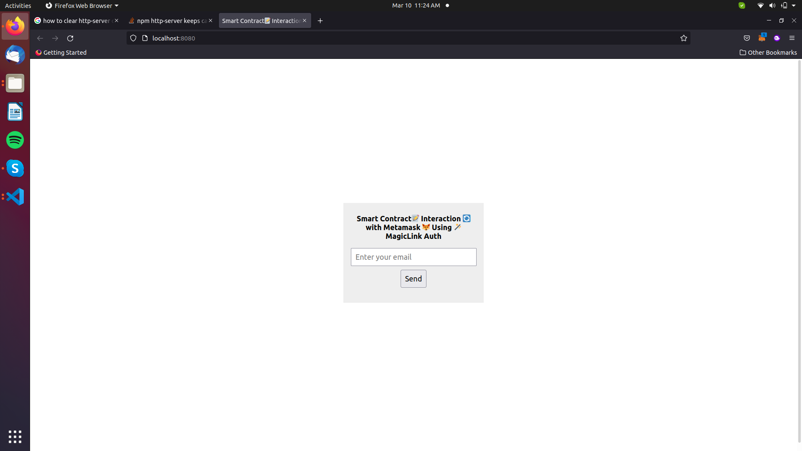
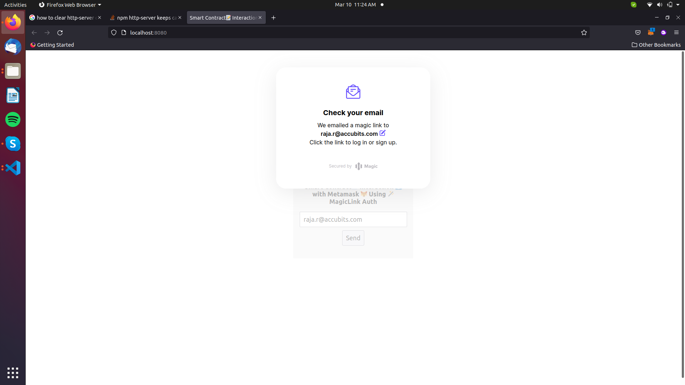
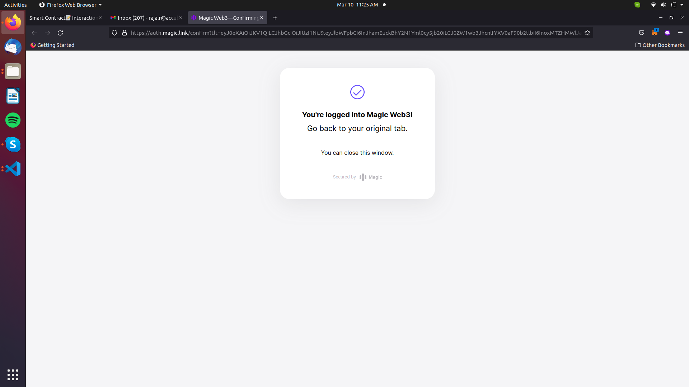
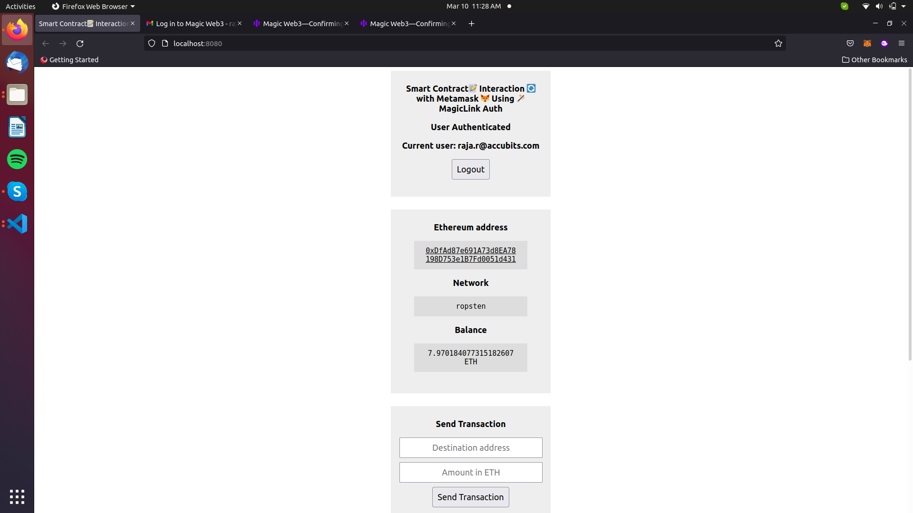
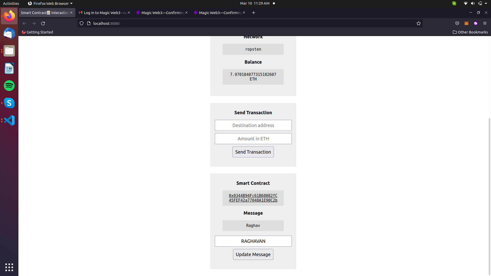
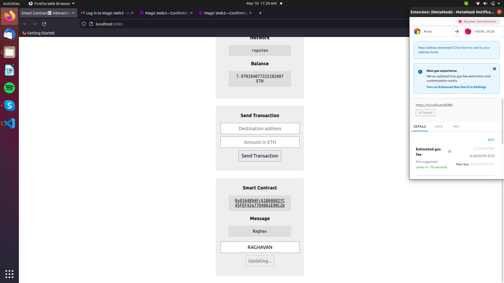
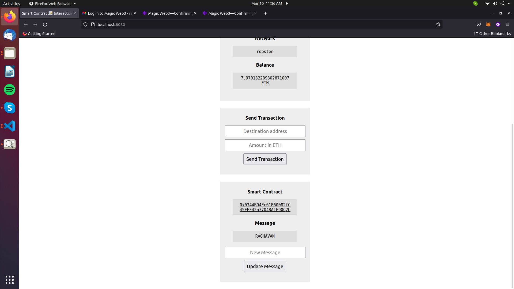

# Smart Contract 📝 Interaction 🔄 with Metamask 🦊 Using  🪄 MagicLink Authentication 🔐 NodeJS
- This Project is a Sample Template of Smart Contract 📝 Interaction 🔄 with Metamask 🦊 Using  🪄 MagicLink Authentication 🔐 NodeJS for getting familiar in feature of Authenticating Metamask Via MagicLink and get interaction with Smart Contract.
- This Template Illustrates how to create a magiclink auth for metamask in Nodejs.
- After Authentication user can able to interact with smart contract.

## Pre-Requisites 🧰
- Go to Magiclink Offical Website
- Get `PUBLISHABLE_API_KEY` 🔑 form MagicLink Dashboard
- Get `SECRET_KEY` 🗝️ form MagicLink Dashboard
```
const magic = new Magic("Paste yor PUBLISHABLE_API_KEY");
```
- Paste the `PUBLISHABLE_API_KEY` in above code which is loacted in `line no.13` in `index.js` file.
- Get contract `ABI` from `REMIX`
```
     var contractABI = [
	{
		"inputs": [],
		"name": "getname",
		"outputs": [
			{
				"internalType": "string",
				"name": "",
				"type": "string"
			}
		],
		"stateMutability": "view",
		"type": "function"
	},
	{
		"inputs": [],
		"name": "name",
		"outputs": [
			{
				"internalType": "string",
				"name": "",
				"type": "string"
			}
		],
		"stateMutability": "view",
		"type": "function"
	},
	{
		"inputs": [
			{
				"internalType": "string",
				"name": "_name",
				"type": "string"
			}
		],
		"name": "setname",
		"outputs": [],
		"stateMutability": "nonpayable",
		"type": "function"
	}
];
```
- Paste the `Contract ABI` in above code which is loacted in `line no.18` in `index.js` file.
- Get Deployed Contract address.
```
  let contractAddress = "Paste your deployed contract Address";
```
- Paste the `Contract Address` in above code which is loacted in `index.js` file.
## Getting started 📖

📁 Create a new folder in VS code.  
- Open Your termial in Vscode and following commands. or press  `Ctrl+Shift+` `

🏃 Run: -- To Initalize Node.  ( Here `-y` means we are saying `yes` to all steps in node creation )
```
npm init -y
```


## Node Dependencies 🎒
Try ` npm i ` in cmd to install all nessecary dependencies mentioned in `package.json` file

or use 

``` 
npm install dotenv 
```
``` 
npm install http-server
```
``` 
npm install magic-sdk
```
``` 
npm install web3
```
``` 
npm install ethers
```

## Sample Smart Contract 📝
- Deploy this smart contract in remix and get `Contract ABI` and `Contract Address`.

```
pragma solidity ^0.8.0;
contract Demo{
  string public name ="Raja";
  function getname()public view returns(string memory){
    return name;
  }
  function setname(string memory _name) public{
    name=_name;
  }
}
```
## Contract ABI of above Sample Smart Contract 📝
```
[
	{
		"inputs": [],
		"name": "getname",
		"outputs": [
			{
				"internalType": "string",
				"name": "",
				"type": "string"
			}
		],
		"stateMutability": "view",
		"type": "function"
	},
	{
		"inputs": [],
		"name": "name",
		"outputs": [
			{
				"internalType": "string",
				"name": "",
				"type": "string"
			}
		],
		"stateMutability": "view",
		"type": "function"
	},
	{
		"inputs": [
			{
				"internalType": "string",
				"name": "_name",
				"type": "string"
			}
		],
		"name": "setname",
		"outputs": [],
		"stateMutability": "nonpayable",
		"type": "function"
	}
];
```
## To Run 🏃

 Run: -- To start http server and run Magiclink Metamask authentication.

```
npm start
```
## Screeshot 👀
### Enter Your Email ID 📭 you get a MagicLink 🪄.


### MagicLink 🪄  is will sent E-mail 📨 to your account.
#
#### Caution ⚠️ : Dont close your current tab go to new tab and login to your mail.


### Check you Email 📭 and click login 🚪.
### After Authentication go back to current tab.

### Now you can see your successfully Authenticated your Metamask 🦊 via Web Browser 🌐.

### Scroll Down Now you can see Smart Contract 📝 Interaction 🔄 Section in Webpage  🌐.

### Now you can see Smart Contract 📝 Contains a message as Raghav.
### Type New Message in Text box and click update message.

### Once you click update message now the browser will interact with Metamask 🦊 to submit transaction.

### After Transaction is completed now you can see the message is update in contract.
